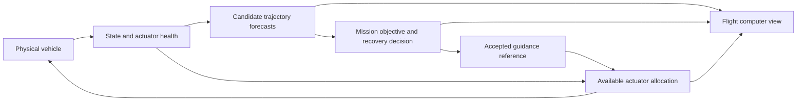

# Alpha.6 audit: resilient flight decisions and continuous vapor

Historical audit and design proposal. See [Interactive recovery](INTERACTIVE_RECOVERY.md)
for the implemented behavior and current model limits; release validation is separate.

10 September 2026. Audited source `794a671`; packaged game source `646ce82`.
This document proposes the next implementation. It does not describe completed
features. Existing user-session reports and a read-only Blender inspection are
preserved in [Research/Resilience](Research/Resilience/audit-evidence.json).

## Observed failures

The current local game log contains three completed mission reports:

| Flight | Outcome | Landing thrust | Terminal plans rejected / attempted |
|---|---|---:|---:|
| 1 | Physical capture | 31.55 s | 21 / 24 |
| 2 | Boostback depleted landing reserve | 0 s | 0 / 0 |
| 3 | Main propellant exhausted | 189.61 s | 932 / 932 |

Flight 3 never found an accepted terminal trajectory. The fallback continued to
target the tower until fuel exhaustion, at approximately 195 m altitude. The
report records 44.19 seconds of fin control and a landing ignition at 2,413 m;
it therefore does not support the conclusion that neither fins nor engines ever
operated. Their intervention did not produce a viable recovery.

That flight also combined engine index 8 failure, fin index 0 jam, attitude gain
changes and wind scale 3. Recorded RCS outages lasted 2.992, 11.300, 6.917 and
3.500 **simulation seconds**. Accelerated playback makes manual click durations
different from simulation durations. An isolated one-second RCS failure has not
been replayed in this audit, and tower reachability has not been independently
established. Those must become separate, reproducible tests.

## Confirmed architectural limitations

1. `RecoveryGuidanceModel.cpp` sets engine count to zero throughout Coast/Entry.
   Only the landing-ignition condition exits this policy; there is no midcourse
   correction burn or return to a recovery boostback mode.
2. The ballistic predictor runs a point-mass, unpowered forecast with assumed
   tail-first drag. It omits the evolving attitude, commanded control allocation
   and alternative powered trajectories. Large attitude errors can invalidate
   this forecast precisely when recovery matters most.
3. `RecoveryLandingPrediction.cpp` evaluates a vertical braking trajectory with
   a fixed current up-projection. Nonpositive up-projection or insufficient core
   braking returns infeasible. The phase transition requires feasibility; there
   is no separate maneuver to recover attitude and reassess the landing choice.
4. Terminal planning begins below 1,800 m and 180 m/s. Its sampled polynomial
   family has one destination: the capture fittings. If candidates fail, energy
   braking still aims at that same target. A lost-tracking replan can also fail
   while leaving the old accepted plan flagged usable; capability-loss handling
   invalidates it in a narrower case. Neither path supplies a certified fallback.
5. `RecoveryDynamicsModel.cpp::AttitudeMoment` counts nominal RCS torque whenever
   RCS fuel remains, ignoring the disabled flag and pressure blend. Its scalar
   authority estimate also does not represent individual-axis actuator limits.
6. RCS permission depends on **requested engine count**, rather than delivered
   engine control authority. Fin moment demand drops to 10% when engine count is
   positive. A command to ignite is therefore treated as a change in available
   control before that authority has necessarily arrived.
7. Fin demand uses a fixed three-fin allocation; jamming one fin does not
   redistribute its missing contribution across healthy fins and other controls.
8. Reserve depletion and envelope failure enter Aborted, suppressing propulsion
   and active fin control. A failed tower mission is not distinguished from an
   operator command to terminate propulsion or a controlled alternate landing.
9. The flight matrix covers Nominal, Crosswind and Offset. The world audit checks
   fault injection, valve response and restoration, but does not fly repeated
   outages through recovery. Existing green tests do not establish fault resilience.

The current terminal planner does consider fuel and searches different durations.
This is not simply a fuel-minimization setting that should be turned up. More
fuel burned at the wrong time or attitude does not guarantee a reachable tower.

## Why the vapor looks stepped and boxed

The original domain is 20 × 16 × 12 m, 64 frames at 24 fps. Inspection of the saved
Blender file confirms **all six collision borders are open** and the adaptive
domain is disabled. It is not a closed-wall simulation.

The runtime multiplies that domain by `4.6 + age * .18`, reads `age * 8`, and clamps
at frame 63 for a twelve-second lifetime. Thus the shape receives at most eight
new source frames per second and freezes after 7.875 s for the remaining 4.125 s.
Translation and expansion continue, which can disguise the freeze in screenshots.

The installed UE5.8 component requests one frame. Its SVT helper casts the float
frame index to an integer; fractional `SetFrame` values do not interpolate density.
`bPlaying=false` also means no valid playback rate is supplied to the streaming
request. Streaming can worsen stepping, but its contribution was not measured here.

The material samples density directly without a spatial extinction margin at the
domain boundary. Large scaling, a bounded cache and increased extinction can
expose rectangular clipping surfaces. Exact per-voxel boundary density and
multi-volume compositing artifacts still need a motion capture/isolation test.

The previous checks established visible volume contribution and bounded instance
counts. They did not establish temporal smoothness. Still screenshots are
insufficient acceptance evidence for this effect.

## Target architecture

Keep force integration, mass accounting, actual actuator response and mechanical
contacts as the reference plant. Replace phase-specific recovery decisions with
an explicit mission supervisor, forecasts and actuator-aware control allocation.
Phases remain useful labels for presentation and hardware sequencing.

### 1. Decide while recovery is still possible

- Evaluate tower return and designated offshore alternatives before terminal
  braking. Track time and fuel needed to restore attitude as part of reachability.
- Forecast a conservative set of reachable positions and arrival velocities,
  with uncertainty from wind, aerodynamic error, mass and actuator response.
  Sampled reachability is an estimate, not a proof of global infeasibility.
- Replan on significant tracking error, control saturation or health changes.
  Allow corrective burns when an unpowered trajectory will lose recovery margin.
- Give every accepted plan an age, input-state timestamp, validity envelope and
  executable fallback. Do not keep following an invalid trajectory indefinitely.
- Choose objectives in order: avoid protected ground areas and structures;
  reach an acceptable recovery corridor; meet contact limits; retain reserves;
  reduce unnecessary fuel. Make reserve policy state-dependent, not a magic amount.
- A failed solve is not evidence that no solution exists. Distinguish numerical
  failure, exhausted search budget, expired input state and constraint violations.

Begin with a bounded translation planner and explicit attitude feasibility checks,
then evaluate a six-degree-of-freedom receding-horizon formulation against the same
force model. Run optimization outside the physics callback. Timestamp its results,
bound computation time and reject stale or invalid outputs. The 120 Hz inner
controller must remain operational when a planning result is late.

NASA's work on [successive convexification with changing mass properties](https://ntrs.nasa.gov/citations/20230018515)
is a useful algorithmic reference. It is not a ready-made atmospheric Starship
controller, nor evidence about SpaceX's proprietary flight software.

### 2. Use the controls that are actually available

- Maintain a health/authority description per engine, gimbal, fin and reaction
  nozzle: availability, measured response, bounds, rates and remaining resources.
- Allocate requested forces and moments jointly within those limits. Feed the
  achievable result and saturation residual back into attitude control and planning.
- Account for valve opening and thrust buildup before reducing other controls.
  Hardware interlocks still apply; simultaneous RCS/engine use is not assumed
  universally permitted by the real vehicle.
- Reallocate after a fin jam or engine loss; stabilize angular velocity before
  pursuing aggressive trajectory correction when that is physically necessary.
- Retain command/measurement separation. Injected faults first provide a known
  health state; hidden failures and sensor estimation are a subsequent extension.

### 3. Separate a failed catch from abandoning the vehicle

Introduce explicit outcomes: `Tower recovery`, `Controlled ditching`,
`Unrecoverable descent`, and `Operator termination`. Tower recovery permission
depends on the vehicle **and** tower state. Offshore alternatives use authored
exclusion zones and a reachable approach corridor; a booster without landing gear
does not magically perform a recoverable land touchdown there.

Use hysteresis and minimum commitment margins to avoid switching targets every
frame. Keep attitude and impact-energy control active when a catch is unavailable,
as long as actual hardware, fuel and operational limits allow it. Preserve the
operator's explicit termination command as a separate action.

The objective of minimizing arrival error under limited propellant has a public
[NASA/JPL reference](https://ntrs.nasa.gov/archive/nasa/casi.ntrs.nasa.gov/20120001230.pdf).
Our site selection and ground-protection rules would remain simulator design
choices, not a reproduction of an operational flight-safety system.

### 4. Make the flight computer inspectable

Add a visible **Flight computer** button and evolve the existing `L` Flight Lab
entry into four compact views: Overview, Trajectory, Systems, Events. Keep the
main flight HUD sparse.

- Show measured/predicted motion, the accepted target path, impact estimate,
  estimated reachable area, protected zones and scheduled burn intervals in 3D.
- Display current objective, decision reason, target validity, time to action,
  fuel required/available/reserved, braking margin and attitude-recovery margin.
- Show requested versus delivered thrust/moment, actuator saturation, unavailable
  hardware and active interlocks. A command is not a delivered force.
- Persist each rejected candidate's limiting constraint and solver status.
  Example: `No accepted tower path — attitude-rate limit`, with expandable detail.
- Expose timestamp, age and confidence of the forecast. The UI reads immutable
  telemetry snapshots; it never edits the physical pose or runs the planner.
- Provide timed fault buttons such as `RCS outage / 1 simulation second`, plus a
  timeline for combined scenarios. Pause and accelerated playback remain explicit.

### 5. Rebuild vapor for motion

First remove the known eight-frame stepping, terminal freeze and hard boundary
exposure. Any revised cache must cover its intended lifetime at its authored time
scale. Use explicit temporal interpolation and validate it on the actual renderer;
do not assume a float frame index or a generic Niagara cache performs this work.

Evaluate a hybrid prototype: bounded local 3D gas simulation around impingement
and the tower, a cheaper advected ground layer for broad transport, and continuous
distant wisps. The transition must hide finite domains, preserve movement through
their edges and respond to wind and delivered deluge/propulsion flow. Keep cold
conditioning vapor separate from heated ground vapor.

For cached fields, test zero-density padding, absorbing edge bands and velocity-
aware interpolation. Simple density blending can ghost fast-moving structures;
it is a comparison candidate, not the final quality criterion. Avoid indefinitely
enlarging a small cache to fill the site.

Epic documents [two-frame SVT interpolation](https://dev.epicgames.com/documentation/unreal-engine/sparse-volume-textures-in-unreal-engine?lang=en-US)
and [Niagara gas boundary controls](https://dev.epicgames.com/documentation/unreal-engine/niagara-fluids-reference-in-unreal-engine).
Neither feature guarantees a performant complete plume. Compare the prototype
against alpha.6 with matched views, GPU timings, streaming statistics and video.

## Implementation sequence and acceptance

| Batch | Deliverable | Required evidence |
|---|---|---|
| A | Fault scheduler, decision log, regression baselines; vapor playback/boundary prototype | Replay captured session plus isolated 1 s outages; motion review of one volume and the full field |
| B | Health-aware control allocation and validity monitoring | Fin/engine/RCS faults with command-versus-delivery traces; no imaginary control authority |
| C | Midcourse replanning and alternate objectives | Recovery within independently checked reachable cases; controlled alternate choice when appropriate |
| D | Flight computer views and guided experiments | Readable decisions and 3D paths, no pose writes, timed faults unaffected by display cadence |
| E | Continuous hybrid vapor and performance tuning | No exposed box surfaces or frozen tails in representative moving views; measured GPU/VRAM/streaming cost |

Keep the current successful returns as regression baselines. Add outages during
separation, coast and entry; permanent RCS loss; individual fin jams; engine and
gimbal failures; wind changes; low fuel; bad approach heading; and an unavailable
tower. Reproduce each at multiple game cadences and with accelerated playback.
Judge physically feasible captures, controlled alternatives and unavoidable losses
separately. A red catch indicator can be the correct outcome of a successful
emergency decision.

Use repeatable seeds and recorded commands, tolerances for Chaos replay, and
headless scenario sweeps. Record the first decision that loses recovery margin,
not just the final crash. Compare predicted and measured future states to catch
model mismatch before optimizing controller gains around it.

## Further gains after the core change

An event-synchronized mission replay can explain why an objective changed and
compare alternative controllers from the same initial conditions. A parallel
advisory planner can be evaluated without controlling the vehicle until it beats
the baseline on recovery quality and computation budget. A later advanced mode
can add imperfect sensors, estimation and uncertain actuator failures. These
features build on observable decisions and reproducible experiments rather than
adding more unconnected HUD numbers.

## Approved scope extension: interactive vehicle and continuous world

10 September 2026, following the user's review. The six workstreams above remain
the core scope. The items below extend that proposal; they are not implemented
or validated by this document. The current alpha executable is unchanged.

### Direct interaction contract

- Show the cursor during normal viewing. Hold right mouse to rotate orbit/free
  cameras; release to return to pointing. Preserve pointer position and discard
  the capture-transition delta so entering or leaving a drag cannot jump the view.
- Left click selects a visible engine, fin or RCS assembly and opens a compact
  contextual card: identity, delivered output, health, Disable/Restore, and a
  timed fault in simulation seconds. Selecting a part alone does not fail it.
- Separate selection/query geometry from physical collision geometry. Resolve
  occlusion and UI ownership before selecting; do not pick an engine through the
  fuselage. Offer a small engine layout for parts inaccessible in the current view.
- Make hover highlighting optional and restrained. Close a card with empty-space
  click or Escape; suppress camera input while manipulating a UI control. Handle
  lost focus, menu opening, right-button release outside the window and resizing.
- Keep a sparse persistent toolbar for Cameras, Flight computer, Weather and
  Playback. Use English labels/tooltips with consistent vector icons. Replace
  the Lab as the primary interaction path, retaining its command API internally.
- Fault commands enter the simulation through one timestamped command interface.
  UI widgets never mutate vehicle transforms, forces or the planner directly.

Confirmed in source: `RecoveryPlayerController::SetMenuVisible(false)` currently
hides the pointer, selects GameOnly input and permanent capture/locking;
`RecoveryCameras.cpp` consumes mouse delta without requiring right-button hold.
Changing only cursor visibility would therefore be incomplete.

### One continuous Earth, atmosphere and weather

The current `build_world_continuity.py` already uses a 6,371 km sphere and common
geodetic sampling for globe, regional and local surfaces. No explicit runtime
level swap at 15 km was found in the inspected presentation code. Do not introduce
a second planet, shrink physical Earth or change gravity to mask a visual seam.

Confirmed: `RecoverySkyComponent.cpp` fades height-fog density between 1.5 and
16 km, then hides it; cloud sampling also changes between 7 and 20 km. The older
`polish_earth_transitions.py` authors a separate 3.5–16 km imagery blend, but the
newer continuity builder rebuilds those materials. Its presence on disk does not
prove that historical shader remains active in the current cooked assets.

Inspect active material graphs and capture ascent/descent across 10–25 km with
individual surface/cloud/fog layers isolated. Determine whether the reported
square is coverage, geometry, depth composition, a stale material or atmospheric
sampling. Inspect cloud-shell radius/centre, planet occlusion and aerial
perspective for the reported orange internal spheres before choosing a fix.

The target is continuous geometry coverage and imagery resolution, plus correctly
scaled atmospheric extinction/scattering to soften distant contrast. Avoid a
screen blur that also blurs the nearby booster. Epic's
[Sky Atmosphere documentation](https://dev.epicgames.com/documentation/en-us/unreal-engine/sky-atmosphere-component-in-unreal-engine)
supports ground-to-space rendering and describes sampling/LUT tradeoffs. Disabling
all optimizations is not an established fix or performance budget.

Add selectable Clear, Coastal haze, Broken clouds and Overcast weather profiles,
with low marine clouds, mid-level coverage and optional thin high clouds. Share
the planetary reference and wind profile with vapor and flight physics; show
when a weather change alters the flight conditions. Blend profiles continuously.
Use [NASA limb photographs](https://science.nasa.gov/earth/earth-observatory/earths-limb-with-a-crescent-moon-150240/)
for scattering/color reference, accounting for their orbital altitude, exposure
and lighting instead of copying their appearance at every flight altitude.

### Propulsion and surface finish

- Rebuild RCS appearance around a narrow nozzle exit, pressure-dependent expansion
  and short pulses driven by delivered force. Improve contrast and temporal
  readability without inflating the entire jet. Current width scales as
  `(.8 + Power * 2.8) * (1 + Vacuum * .65)`; visibility is already tied to a
  measured-force envelope, so preserve that connection.
- Separate engine exhaust/condensation from ground-generated steam and dust.
  Evaluate the airborne effect from ignition using ambient conditions; generate
  ground effects from plume impingement and available water/surface material,
  not solely a fixed altitude or an unconditional ignition flag. A restart high
  above the site must not instantly fill the pad with steam.
- Keep the explicit SVT interpolation/domain fixes above as a prerequisite for
  increasing density. Validate motion at normal and accelerated playback with
  video, streaming statistics and GPU timing, not attractive still frames alone.
- Diagnose Starship reflection grain with film grain disabled and matched native
  versus reconstructed views. Inspect normal-map frequency/mips, roughness,
  tangents and reflection history separately. Adjust steel surface detail and
  reflection quality together, preserving shape and avoiding excessive smoothing.
  [Epic's Lumen guide](https://dev.epicgames.com/documentation/en-us/unreal-engine/lumen-global-illumination-and-reflections-in-unreal-engine)
  documents noise/quality/cost tradeoffs; the current source alone does not identify
  the dominant cause of the user's reflection artifact.

### Physical capture equilibrium

Existing nominal regression results permit a small contact tilt, and measured
settled cases have reached roughly 1.8–2.4 degrees. Check both lug contact faces,
rail normals, rail heights/travel, load distribution, friction and frame compliance
before modifying guidance gains. Record both normal loads, contact points, body
angular rate and attitude throughout settling. Align the approach to the actual
support geometry and minimize residual lateral motion at first contact.

Acceptance must require stable two-sided support and explain any residual tilt
from mechanical equilibrium. Do not enforce a final rotation, weld the booster
to the tower or hide failed support behind a Secured label.

### Updated delivery order and verification

1. Reproducible fault/decision baselines and continuous-vapor prototype (batch A).
2. Visible-cursor/RMB interaction foundation and selectable parts, using the same
   command/snapshot boundary that the flight computer will consume.
3. Health-aware allocation, valid replanning and alternate objectives (B–C), then
   expose their real diagnostics and trajectories in the computer (D). Clearly
   distinguish the flown trail, accepted plan, ballistic prediction and candidate
   alternatives; never label a decorative curve as a computed reachable path.
4. Ground-to-space continuity, layered weather and vapor/RCS completion (E plus
   the extensions above), followed by steel finish and interface visual polish.
5. Capture equilibrium validation and complete regression/package verification.

Keep simulation, telemetry/commands, interface and visual presentation separate.
Retain current successful returns, compare isolated and combined faults, exercise
cursor/menu/focus transitions, record uninterrupted ground-to-space flights and
inspect smoke in motion at the pad and from distant cameras. Measure matched
1440p performance and memory on the existing hardware before claiming a gain.
The optional attitude schematic belongs in the flight computer first; do not
crowd the main flight HUD with another permanent panel.
